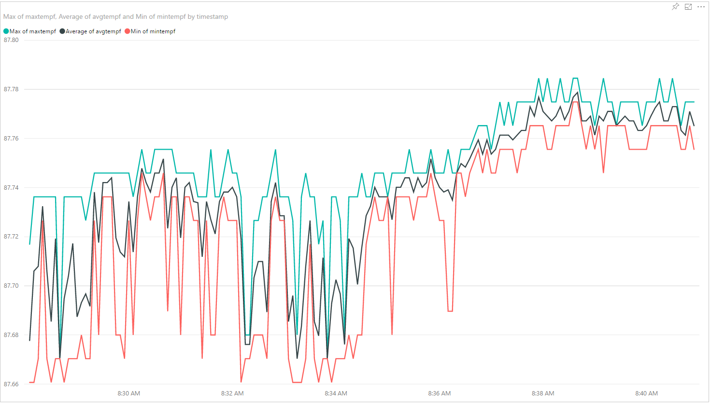

# :cloud: WeatherStation
> Weather station connected to Azure that collects humidity/temperature and Barometric Pressure

## :wrench: Prerequisites

* [Node](https://nodejs.org/en/)

* [SparkFun Weather Shield](https://github.com/rwaldron/j5-sparkfun-weather-shield)

* [Azure](https://azure.microsoft.com/en-us/)

* [Power BI](https://powerbi.microsoft.com/en-us/)

## 🚀 Getting Started

* `git clone https://github.com/ragmha/weather-station.git`

* `yarn`

* `Add  CONNECTION STRING,in` **weather.js** 

## License
[MIT](./license) © [Raghib Hasan](http://raghibm.com/)
